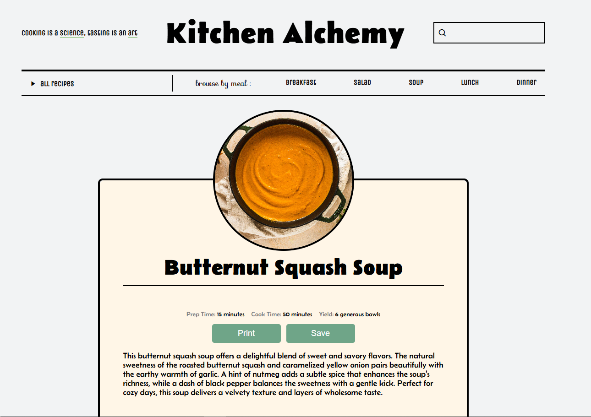

# Kitchen Alchemy
[*Link to Live Site*](https://kitchenalchemy.netlify.app/)
This is a simple, front-end React + TypeScript website. I made this with the intention to keep all my favorite recipes in one spot. As I experiment more in the kitchen, the list of recipes will grow! 

## Features 

- **Search by Meal:** Look for recipes for breakfast, lunch, or dinner. You can also look for soups and salads. 
- **Filter by Cuisine, Ingredient, or Season:** Filter recipes by cuisine, ingredient, or season; each with their own subcategories to choose from. If you would like your results to be more specific, you can browse by a meal and a subcategory. For example: "Japanese + Breakfast" or "Autumn + Soup".
- **Search Bar:** Effortlessly find recipes by name with a seamless and responsive search feature powered by React.
- **Print Recipe:** Save a physical copy of the recipe.

## Visuals

### Homepage

### Recipe

## Technologies Used

- React
- TypeScript
